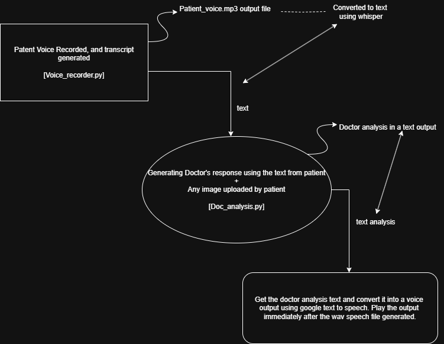

# 🩺 DocThor – AI Doctor Voice Assistant

DocThor is an AI-powered medical assistant application that enables users to record their symptoms through voice, upload relevant images (e.g., injury photos), and receive a spoken diagnosis or advice generated by an AI doctor.

---

## 📌 Key Features

- 🎙️ Record patient voice and convert it to text using OpenAI's Whisper (`whisper-large-v3`)
- 🧠 Generate a medical response using Meta LLaMA (via Groq API)
- 🖼️ Analyze uploaded images to enrich the doctor's diagnosis
- 🔊 Convert the AI doctor's response to voice using Google Text-to-Speech (`gTTS`)
- 💻 Simple and intuitive interface powered by Gradio

---

## 🎥 Demo
https://github.com/user-attachments/assets/e77a6c4d-c814-488c-9ab6-02cc52d0cf50

---

## 🧱 Tech Stack

- Python
- Gradio (UI)
- Whisper Large V3 (Speech-to-text)
- Meta-LLaMA via [Groq API](https://groq.com/)
- gTTS (Text-to-speech)
- ffmpeg
- pyaudio / portaudio (for audio handling)

---

## 🧑‍💻 Setup Instructions

### 1. Clone the Repository

```bash
git clone https://github.com/yourusername/DocThor.git
cd DocThor
```

### 2. Create a Virtual Environment (Recommended)

```bash
python -m venv venv
source venv/bin/activate  # On Windows: venv\Scripts\activate
```

### 3. Install Dependencies

```bash
pip install -r requirements.txt
```

### 4. Set the Groq API Key

Obtain a key from [Groq](https://groq.com/) and set it as an environment variable:

```bash
export GROQ_API_KEY=your_key_here        # macOS/Linux
set GROQ_API_KEY=your_key_here           # Windows CMD
$env:GROQ_API_KEY="your_key_here"        # Windows PowerShell
```

---

## 🚀 Run the App

```bash
python app.py
```

This will open a browser window with the Gradio interface, where you can:

- Record your voice
- Upload an image if needed
- Hear the AI doctor's diagnosis in voice form

---

## 🧭 Workflow Diagram



---

## 📁 Project Structure

```
├── app.py                     # Main Gradio interface
├── Voice_recorder.py          # Handles voice input and transcription
├── Doc_analysis.py            # Analyzes input and generates doctor's response
├── requirements.txt           # List of dependencies
├── Docthor_Workflow.drawio.png # Workflow diagram
└── README.md
```

---

## ⚠️ Disclaimer

This project is for **educational and demonstration purposes only**. It is **not intended for real medical diagnosis or treatment**. Always consult a licensed medical professional for health issues.

---

## 🤝 Contributing

Pull requests are welcome. For major changes, please open an issue first to discuss what you would like to change.
